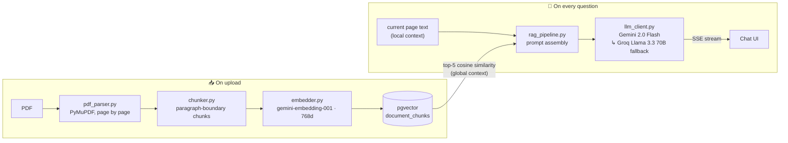

<div align="center">

# 📖 folio

### Read smarter. Ask anything.

**Folio puts your PDF and a context-aware AI side by side — in one tab.**
It knows the page you're on, reads what you highlight, and remembers the whole document.

<br/>


<br/>

<!-- Drop a full-width screenshot or GIF of the workdesk here -->
<!--  -->

</div>

---

## Why Folio?

Studying from a PDF usually means juggling three windows: the document, a chatbot you keep copy-pasting into, and wherever your notes live. Every switch costs context — yours *and* the AI's.

Folio collapses that entire loop into a single workdesk:

```
┌────────────────────────┬──────────┬─────────────────────┐
│                        │          │                     │
│      📄 Your PDF       │ 🗒 Notes │   ✨ AI Assistant   │
│                        │          │                     │
│   reads with you,      │  auto-   │  knows your page,   │
│   page by page         │  saved   │  recalls the whole  │
│                        │          │  document           │
└────────────────────────┴──────────┴─────────────────────┘
```

---

## ✨ Features

| | Feature | What it does |
|---|---------|--------------|
| 🧠 | **Page-aware AI** | Your current page is injected into every prompt automatically. Ask *"what does this mean?"* — it just knows. |
| 🔍 | **Hybrid RAG** | Local context (the page you're reading) **+** global context (vector search across the whole document) on every single query. Ask about chapter one from page eighty. |
| 🖱️ | **Highlight-to-Ask** | Select any sentence → **Explain · Define · Summarise** in one click. No retyping. |
| 🗒️ | **Sticky notes** | A stack of real paper-style notes next to your reading — add, recolor, delete. Auto-saved per document with a 1s debounce. |
| 🎯 | **Focus mode** | Collapse every panel and give the PDF 100% of the screen. One click each way. |
| 🔄 | **Sessions that persist** | Your page, chat history, and notes are restored exactly where you left them. |
| 🌗 | **Notion-style theming** | Paper-white light mode and charcoal dark mode, applied before first paint — no flash. |
| 🔐 | **Private by default** | Google OAuth, row-level security, per-user storage paths, and 1-hour signed URLs. |

---

## 🧠 How the Hybrid RAG works

Built **from scratch** — no LangChain, no LlamaIndex. Every stage is explicit, readable Python:



Design decisions that matter:

- **Paragraph-boundary chunking** — never fixed character counts. Oversized paragraphs fall back to sentence-boundary splits.
- **Session-scoped retrieval** — every similarity search is filtered by `session_id` *before* ranking. Your chemistry textbook never pollutes your history essay.
- **Always hybrid** — both contexts ship with every prompt. No "retrieval missed" failure mode for the page in front of you.
- **Graceful fallback** — if Gemini's free-tier quota is hit, the same prompt streams from Groq's Llama 3.3 70B instead.

---

## 🏗️ Architecture

The codebase follows one non-negotiable rule: **one external dependency = one wrapper file.** Swapping any provider means changing exactly one file.

```
folio/
├── frontend/                  React 18 + Vite
│   └── src/
│       ├── pages/             Landing · Dashboard · Workdesk
│       ├── components/
│       │   ├── pdf/           PDFViewer.jsx     ← only file that touches PDF.js
│       │   ├── chat/          AIChat.jsx        ← streamed markdown chat
│       │   ├── notes/         NotesPanel.jsx    ← sticky notes stack
│       │   ├── workdesk/      Workdesk.jsx      ← split layout, resize, focus mode
│       │   └── ui/            Button · Modal · Toast · Skeleton · FadeUp
│       ├── services/
│       │   ├── supabaseClient.js                ← only file importing supabase-js
│       │   └── authService · pdfService · sessionService · chatService
│       ├── store/             Zustand: session · layout · pdf · chat
│       └── styles/globals.css ← every color in the app lives here as a CSS variable
│
└── backend/                   Python + FastAPI
    ├── main.py                app + CORS
    ├── config.py              ← ALL env vars and limits
    ├── dependencies.py        JWT auth (server-side identity, always)
    ├── routers/               pdf · sessions · chat      (thin — zero business logic)
    └── services/
        ├── pdf_parser.py      ← only file that touches PyMuPDF
        ├── chunker.py         paragraph-boundary chunking
        ├── embedder.py        ← only file that calls the embedding API
        ├── vector_store.py    ← only file that touches pgvector
        ├── rag_pipeline.py    orchestration: parse → chunk → embed → store / retrieve
        ├── llm_client.py      ← only file that calls Gemini / Groq
        ├── storage.py         ← only file that touches Supabase Storage
        └── session_manager.py sessions CRUD
```

**Other permanent rules**

- Routers call services. Services call services. Nothing else crosses layers.
- No hardcoded colors — every component reads CSS variables (`--bg`, `--surface`, `--accent`, …), which is how dark mode is a token swap, not a rewrite.
- All keys, model names, and limits live in `config.py` / `constants.js`. Nothing inline.
- Scroll and keystroke events are debounced (page changes 300ms, notes autosave 1000ms).

---

## 🛠️ Tech stack

| Layer | Choice | Why |
|-------|--------|-----|
| Frontend | **React 18 + Vite** | Fast HMR, lazy-loaded routes |
| Styling | **CSS variables + Tailwind** | Notion-inspired design system, instant theming |
| PDF rendering | **PDF.js v4** (`pdfjs-dist`) | Canvas + selectable text layer |
| State | **Zustand** | Minimal, no boilerplate |
| Animation | **framer-motion** | Landing page only — code-split so it never ships to the app |
| API | **FastAPI** | Async, typed, SSE streaming |
| PDF parsing | **PyMuPDF** | Fast page-by-page text extraction |
| Chat LLM | **Gemini 2.0 Flash** → **Groq Llama 3.3 70B** | Free tier + automatic fallback |
| Embeddings | **gemini-embedding-001** (768d) | Free tier, strong retrieval quality |
| Vector DB | **PostgreSQL + pgvector** (Supabase) | Cosine similarity with SQL-level session filtering |
| Auth & storage | **Supabase** (Google OAuth, Storage, RLS) | Security handled at the database layer |

---

## 🚀 Getting started

### Prerequisites

- Node.js 18+, Python 3.11+
- A [Supabase](https://supabase.com) project (free tier works)
- API keys: [Google AI Studio](https://aistudio.google.com/app/apikey) · [Groq](https://console.groq.com/keys)

### 1 · Supabase setup

Enable **Google OAuth** under *Authentication → Providers*, create a **private storage bucket named `pdfs`**, then run in the SQL editor:

```sql
create extension if not exists vector;

create table sessions (
  id            uuid primary key default gen_random_uuid(),
  user_id       text not null,
  filename      text not null,
  storage_path  text not null,
  current_page  int  default 1,
  notes         text,
  created_at    timestamptz default now()
);

create table document_chunks (
  id           uuid primary key default gen_random_uuid(),
  session_id   uuid references sessions(id) on delete cascade,
  page_number  int,
  chunk_index  int,
  text_content text,
  embedding    vector(768)
);

create table chat_history (
  id          uuid primary key default gen_random_uuid(),
  session_id  uuid references sessions(id) on delete cascade,
  role        text,
  content     text,
  created_at  timestamptz default now()
);

-- Session-scoped similarity search (the WHERE comes before the ranking)
create or replace function match_chunks(
  query_embedding vector(768),
  match_session_id uuid,
  match_count int
) returns table (page_number int, text_content text, similarity float)
language sql stable as $$
  select dc.page_number, dc.text_content,
         1 - (dc.embedding <=> query_embedding) as similarity
  from document_chunks dc
  where dc.session_id = match_session_id
  order by dc.embedding <=> query_embedding
  limit match_count;
$$;
```

### 2 · Backend

```bash
cd backend
python -m venv .venv && source .venv/bin/activate
pip install -r requirements.txt
cp .env.example .env        # fill in your keys
uvicorn main:app --reload   # → http://localhost:8000
```

### 3 · Frontend

```bash
cd frontend
npm install
cp .env.local.example .env.local   # fill in your Supabase keys
npm run dev                        # → http://localhost:5173
```

Sign in with Google, upload a PDF, and start asking.

### Environment variables

| File | Variable | Purpose |
|------|----------|---------|
| `backend/.env` | `SUPABASE_URL` | Supabase project URL |
| | `SUPABASE_SERVICE_KEY` | Service-role key (server-side only) |
| | `GEMINI_API_KEY` | Chat + embeddings |
| | `GROQ_API_KEY` | Fallback LLM |
| `frontend/.env.local` | `VITE_SUPABASE_URL` | Supabase project URL |
| | `VITE_SUPABASE_ANON_KEY` | Public anon key (RLS-protected) |

---

## 📏 Limits (free-tier guardrails)

| Constraint | Value |
|------------|-------|
| Max PDF size | 50 MB |
| Max PDF pages | 300 |
| PDFs per user | 3 |
| AI queries per session | 20 / hour |

---

## 🗺️ Roadmap

- [x] Workdesk: split view, resizable panels, focus mode, dark mode
- [x] Google OAuth + persistent sessions
- [x] From-scratch RAG pipeline (chunk → embed → pgvector)
- [x] Streaming AI chat with hybrid retrieval + Groq fallback
- [x] Highlight-to-Ask
- [x] Sticky notes panel
- [x] Animated Notion-style landing page
- [ ] Deployment (Vercel + Render)
- [ ] Continuous scroll with virtualized rendering + thumbnails / TOC sidebar
- [ ] Reverse citation jump — click an AI answer, land on the source page
- [ ] Inline annotations & multi-document context

---

<div align="center">

Made by **Nithik Deva**

*If this project interests you, a ⭐ goes a long way.*

</div>
